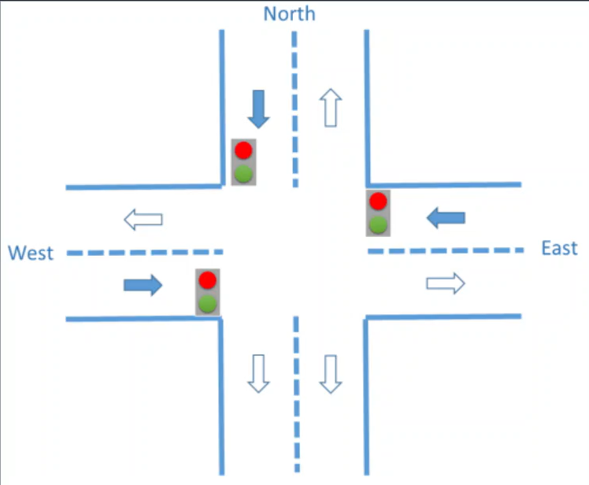

# Traffic Control Using Markov Decision Process

## Description
Developed in 2022, "Traffic Control Using Markov Decision Process" is a university project made during the second course of Computer Engineering at UC3M in collaboration with @angelmrtn.

It is the final project of the subject "Artificial Intelligence" and the solution to the problem proposed. The main goal of this project was to put in practice the **Markov Decision Process** and **Bellman Equations** studied in class.

## Table of Contents
- [Installation](#installation)
- [Usage](#usage)
- [Problem Proposed](#problem-proposed)
- [License](#license)
- [Contact](#contact)

## Installation
No special installation is needed for this code to work.

## Usage
To execute the code you just have to run **main.py**. Once done the code will ask to input the cost of each operation. The default corresponding to the project statement is the value **20** but it can be changed as long as it is 1 or higher.

## Problem Proposed
This project's mission is to find optimal decisions for every possible traffic situation at the intersection pictured below. Traffic can accumulate in each of it's 3 directions and the decision must be which traffic light to activate in each state to get to the least congested state possible. 

An action is not always going to affect the traffic in the same way. Instead, every state has a certain probability to go to another one with each specific action. These probabilities are computed using the **csv file** in this repository with a total of 8785 different examples. In this file, states are a set of 3 words that can be "Low" or "High" corresponding to the traffic situation in each direction. The light activated is represented with a letter (E=East, W=West, N=North).

After the code is executed, it will return a dictionary with the best traffic light to activate in each possible state with **the mission of getting as soon as possible to the state "LLL"** (Low;Low;Low).

## License
This project is licensed under the **MIT License**. This means you are free to use, modify, and distribute the software, but you must include the original license and copyright notice in any copies or substantial portions of the software.

## Contact
If necessary, contact the owner of this repository.
